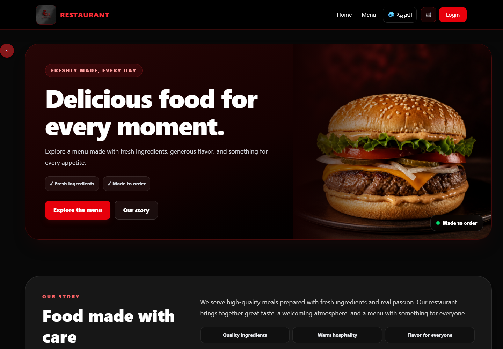
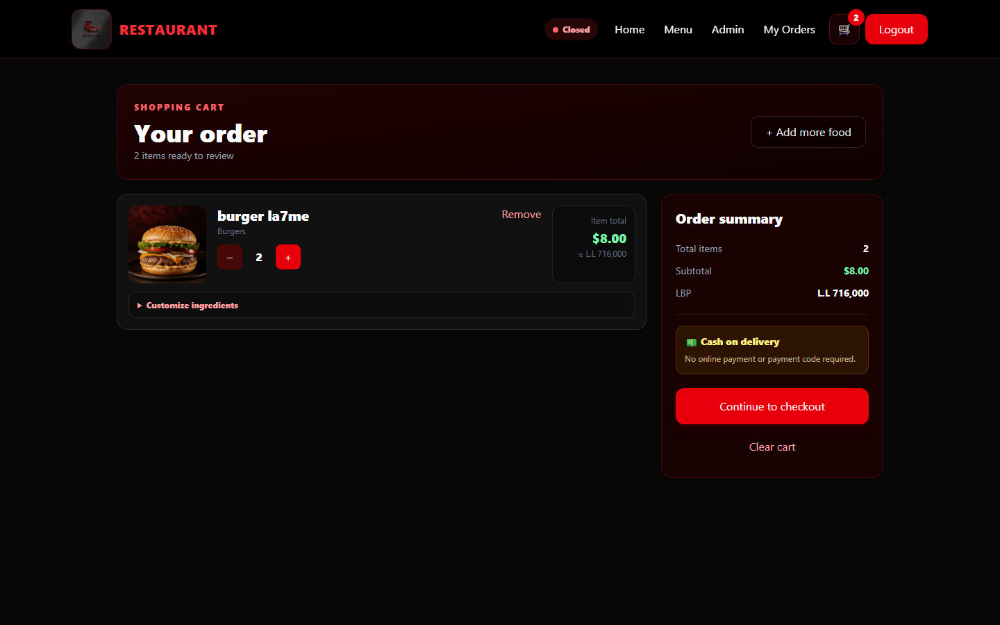
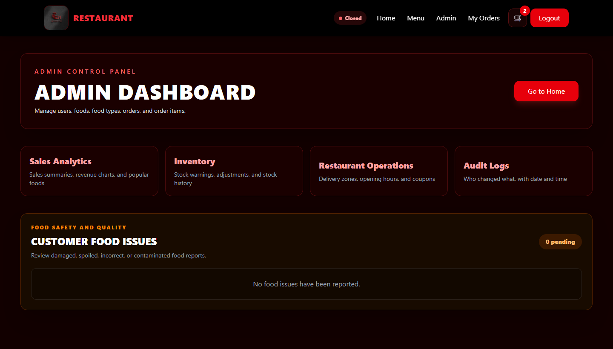

# Restaurant Ordering System

A full-stack restaurant ordering application built with Next.js, React,
TypeScript, Tailwind CSS, Prisma, and PostgreSQL.

The application allows customers to create accounts, browse food items,
manage a shopping cart, place orders, and follow their order status.
Administrators can manage users, food categories, food items, inventory,
orders, analytics, and audit records.

## Screenshots

### Home and Menu



### Shopping Cart



### Admin Dashboard



## Main Features

### Customer Features

- Responsive mobile and desktop design
- User registration and login
- Secure cookie-based sessions
- Restaurant menu and food categories
- Food search and filtering
- Shopping cart
- Quantity management
- Checkout and delivery information
- Order creation
- Order status tracking

### Administrator Features

- Admin and Super Admin authorization
- User management
- Food management
- Food category management
- Inventory management
- Order management
- Order item management
- Analytics dashboard
- Operations dashboard
- Audit logs

## Technology Stack

- Next.js 15
- React 19
- TypeScript
- Tailwind CSS 4
- Prisma 6
- PostgreSQL
- bcrypt
- Zod

## Project Structure

```text
src/
├── app/          # Pages, layouts, and routes
├── components/   # Reusable interface components
├── context/      # React context providers
├── lib/          # Authentication, database, and utility code
├── server/       # Server actions and database operations
└── types/        # Shared TypeScript types

prisma/
└── schema.prisma # Database models and relationships

public/
└──               # Images and public files
```

## Installation

Clone the repository:

```bash
git clone https://github.com/Fadelch/restaurant-ordering-system.git
```

Open the project:

```bash
cd restaurant-ordering-system
```

Install the dependencies:

```bash
npm install
```

Copy `.env.example` to `.env` and enter your own configuration:

```env
DATABASE_URL="your-postgresql-database-url"
AUTH_SECRET="your-long-random-authentication-secret"
SUPER_ADMIN_EMAIL="your-super-admin-email"
```

Generate the Prisma client:

```bash
npx prisma generate
```

Apply the database migrations:

```bash
npx prisma migrate deploy
```

Run the development server:

```bash
npm run dev
```

Open the application in your browser:

```text
http://localhost:3000
```

## Available Commands

```bash
npm run dev
```

Starts the development server.

```bash
npm run build
```

Creates a production build.

```bash
npm run start
```

Starts the production server after building.

## Security

Private environment files are excluded from Git through `.gitignore`.
Never commit database passwords, authentication secrets, tokens, or
production credentials.

## What I Learned

While building this project, I practiced:

- Creating responsive interfaces
- Building reusable React components
- Managing client and server state
- Designing relational database models
- Using Prisma with PostgreSQL
- Implementing authentication and authorization
- Protecting administrator routes
- Validating data with Zod
- Managing orders and inventory
- Organizing a full-stack Next.js application

## Future Improvements

- Email verification
- Password reset
- Online payment provider integration
- Real-time order notifications
- Customer reviews and ratings
- Saved customer addresses
- Automated testing
- Cloud image storage
- Production monitoring

## Author

Created by **Fadel Chaaban**.

GitHub: `Fadel chaaban`
