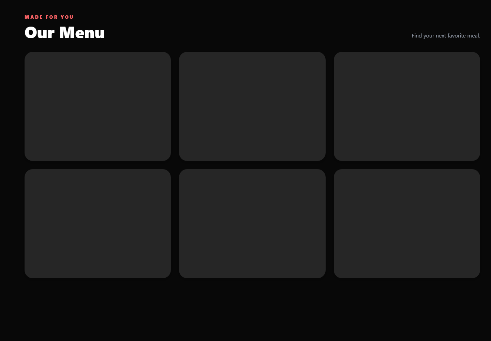
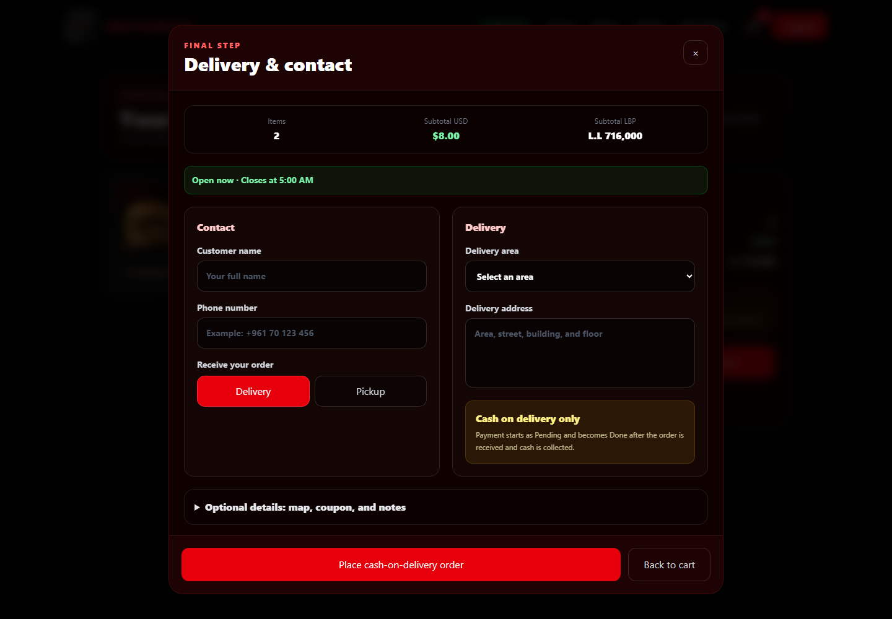
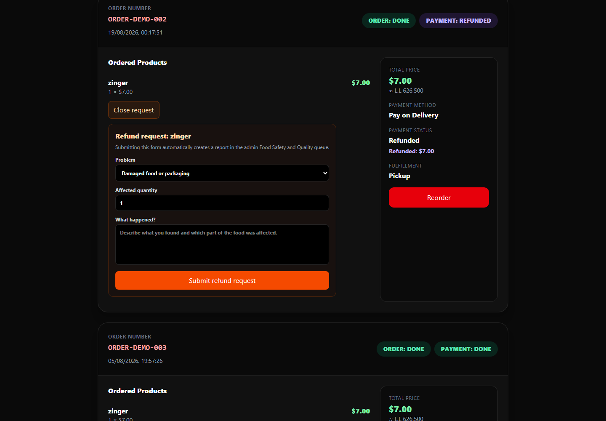
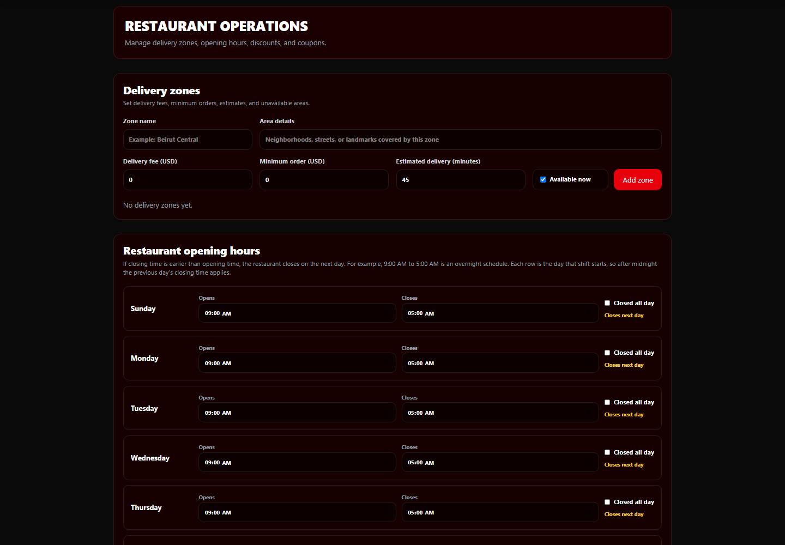

# Restaurant Ordering System

A full-stack restaurant ordering application built with Next.js, React,
TypeScript, Tailwind CSS, Prisma, and PostgreSQL.

The application allows customers to create accounts, browse food items,
manage a shopping cart, place orders, and follow their order status.
Administrators can manage users, food categories, food items, inventory,
orders, analytics, and audit records.

## Screenshots

### Home


### Menu



### Shopping Cart


### Cash-on-Delivery Checkout



### Customer Refund Request



### Admin Dashboard


### Restaurant Operations



## Main Features

### Customer Features

- Responsive mobile and desktop design
- User registration and login
- Secure password recovery with expiring, one-time reset links
- Secure cookie-based sessions
- Restaurant menu and food categories
- Food search and filtering
- Shopping cart
- Quantity management
- Compact cash-on-delivery checkout
- Payment status tracking
- Damaged, spoiled, or unsafe food reporting and refund requests
- Checkout and delivery information
- Order creation
- Order status tracking

### Administrator Features

- Admin and Super Admin authorization
- User management
- Food management
- Food category management
- Inventory management
- Order management
- Order item management
- Food quality issue review and refund approval
- Analytics dashboard
- Operations dashboard
- Audit logs

## Technology Stack

- Next.js 15
- React 19
- TypeScript
- Tailwind CSS 4
- Prisma 6
- PostgreSQL
- bcrypt
- Zod
- Sentry
- Upstash Redis rate limiting
- Vercel Blob

## Project Structure

```text
src/
├── app/          # Pages, layouts, and routes
├── components/   # Reusable interface components
├── context/      # React context providers
├── lib/          # Authentication, database, and utility code
├── server/       # Server actions and database operations
└── types/        # Shared TypeScript types

prisma/
└── schema.prisma # Database models and relationships

public/
└──               # Images and public files
```

## Installation

Clone the repository:

```bash
git clone https://github.com/Fadelch/restaurant-ordering-system.git
```

Open the project:

```bash
cd restaurant-ordering-system
```

Install the dependencies:

```bash
npm install
```

Copy `.env.example` to `.env` and enter your own configuration:

```env
DATABASE_URL="your-postgresql-database-url"
AUTH_SECRET="your-long-random-authentication-secret"
SUPER_ADMIN_EMAIL="your-super-admin-email"
APP_BASE_URL="http://localhost:3000"
```

`.env.example` documents the remaining optional/local and required hosted
service variables. Do not put real credentials in `.env.example`. Local
development may omit cloud-service credentials; staging and production must
configure the required Neon/PostgreSQL, Upstash, Resend, Sentry, and Blob
values described in [the deployment guide](docs/deployment.md).

Generate the Prisma client:

```bash
npx prisma generate
```

Apply the database migrations:

```bash
npx prisma migrate deploy
```

Use a disposable PostgreSQL database for tests. Never run integration tests
against production data.

Run the development server:

```bash
npm run dev
```

Open the application in your browser:

```text
http://localhost:3000
```

## Before Publishing — Required Configuration Reminder

Do not publish the restaurant application until these items are completed:

- [ ] Set `APP_BASE_URL` to the final hosted HTTPS address, not localhost.
- [ ] Create a Resend account and verify the restaurant-owned sending domain
      with the required SPF and DKIM DNS records.
- [ ] Create a Resend API key with **Sending access** and store it as
      `RESEND_API_KEY` in the hosting provider's environment variables.
- [ ] Set `EMAIL_FROM` to an address on the verified restaurant domain, for
      example `Restaurant Name <accounts@yourrestaurant.com>`.
- [ ] Configure `UPSTASH_REDIS_REST_URL` and
      `UPSTASH_REDIS_REST_TOKEN` so production authentication, password
      recovery, checkout, and protected mutations do not fail closed.
- [ ] Add all production secrets through the hosting dashboard. Never commit
      them to Git or place them in client-side variables.
- [ ] Redeploy after adding or changing environment variables.
- [ ] Test password reset with a real active customer account, confirm the
      link uses the hosted domain, and verify delivery in the Resend logs and
      the customer's inbox/spam folder.

## Available Commands

```bash
npm run dev
```

Starts the development server.

```bash
npm run build
```

Creates a production build.

```bash
npm run start
```

Starts the production server after building.

```bash
npm test
npm run test:data-integrity
npm run test:financial
npm run test:checkout
npm run test:password-recovery
```

Runs unit and focused integration/security suites.

```bash
npm run verify
```

Runs the complete non-cloud local release gate and stops on failure. See
[the release process](docs/release.md) for staging, migration, promotion,
rollback, versioning, and tagging requirements.

```powershell
npm run package:source
```

Creates a secret-free source archive from a clean Git working tree.

## Security

Private environment files are excluded from Git through `.gitignore`.
Never commit database passwords, authentication secrets, tokens, or
production credentials.

Before commercial use, review [asset rights](docs/asset-licenses.md),
[dependency licenses](docs/dependency-licenses.md), and the
[draft ownership/support checklist](docs/software-terms-checklist.md). This
private repository currently has no project-level license grant.

## What I Learned

While building this project, I practiced:

- Creating responsive interfaces
- Building reusable React components
- Managing client and server state
- Designing relational database models
- Using Prisma with PostgreSQL
- Implementing authentication and authorization
- Protecting administrator routes
- Validating data with Zod
- Managing orders and inventory
- Organizing a full-stack Next.js application

## Future Improvements

- Email verification
- Online payment provider integration
- Real-time order notifications
- Customer reviews and ratings
- Saved customer addresses
- Production monitoring

## Author

Created by **Fadel Chaaban**.

GitHub: `Fadel chaaban`
